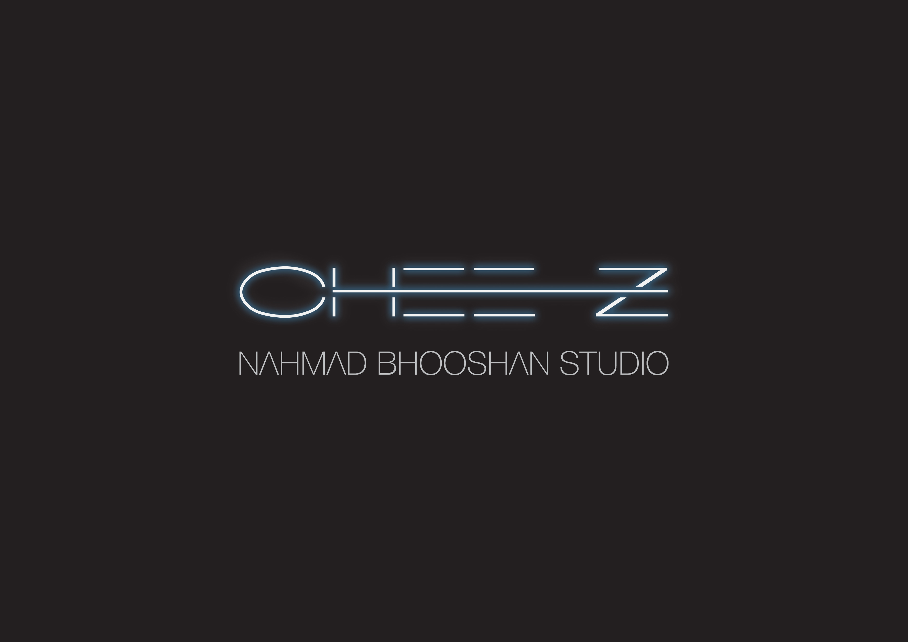

# Team Chee-Z
# Bhavatarini / Atahan / Taeyoon
---

* Evolving chain reaction concept from 2D to 3D - Unity & Model
* Fabricated study model 1 & 2 to research how the subdivision concept can be applied to architecture.
* Discussing how the subdivision concept can be applied to different scales - urbanism & building scale.
* Looking at the history of London housing, and researching case studies such as Super Blocks of Barcelona.
* Identifying a specific group of clients to address : Young working population in London, who need affordable housing in Central London.
* Figuring out how an appropriate amount of voids can be maintained by tempering with the game rules. 

_TEAM CHEE-Z_

